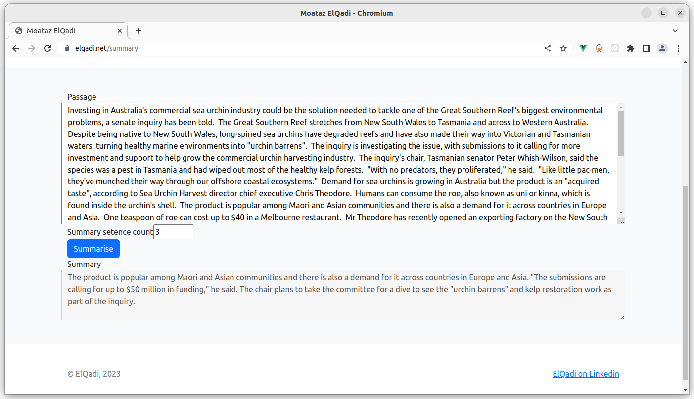
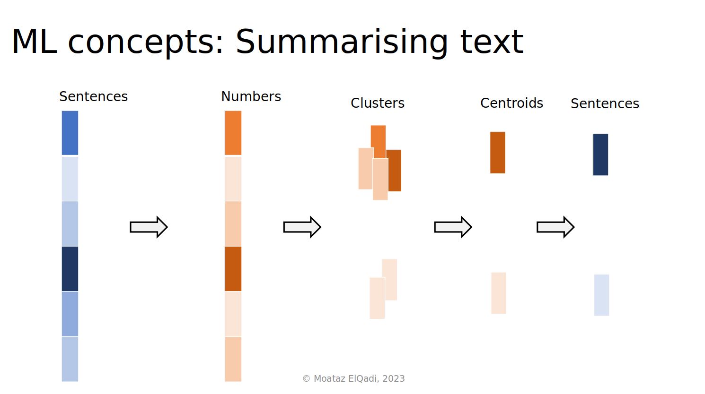
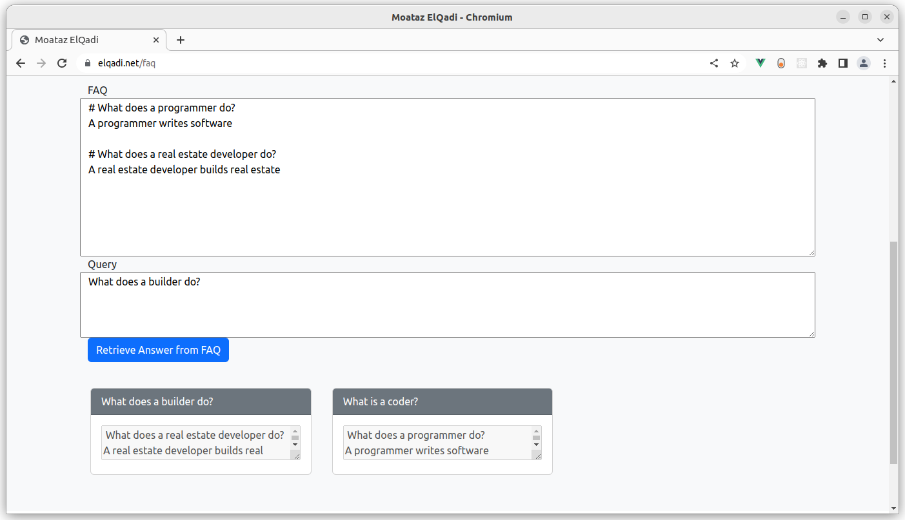
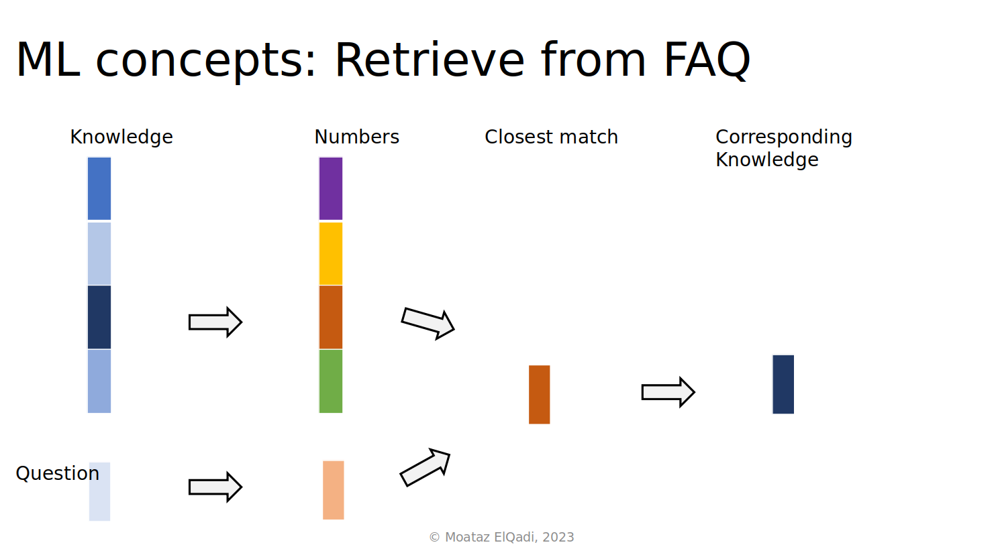
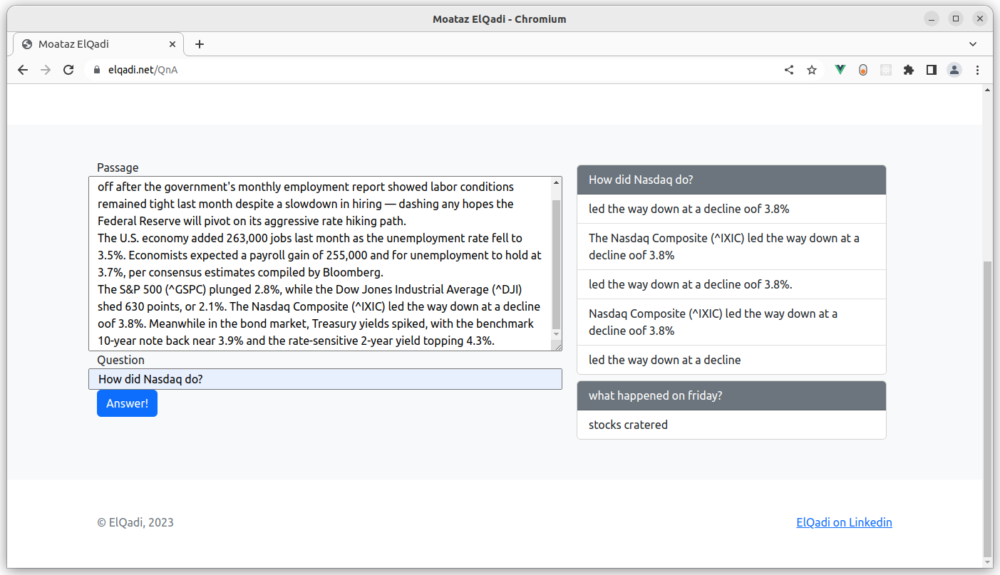
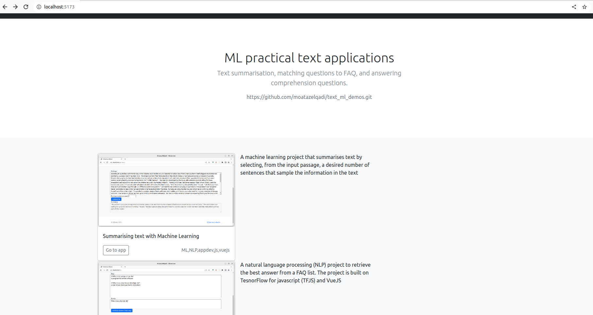

# Machine Learning solutions to three practical text problems *with complete source code*

## Executive summary
This repository presents three case studies of applying Machine Learning to text data. The examples include text summarisation, matching questions to FAQ, and answering comprehension questions. In each of these, the business motivation is first presented, followed by a high level presentation of the Machine Learning idea behind the solution.

The presented solutions completely run in a web browser, removing the costs, risks, and overhead of operating servers. The source code for all use cases is available in the repository. 

-----
## Introduction
The productivity gains enabled by Artificial Intelligence (AI) are almost undisputed. Most people now recognise the need to adopt AI in their organisations. This ambition, however, is usually deterred by a lack of experience and the technical debt created by these solutions.    

The three Javascript applications presented here show that practical AI solutions can be implemented as front end applications using open source technology. This means that such solutions can be implemented with minimal disruption to the existing IT infrastructure and workforce.

## Case study 1: Summarising text with Machine Learning
### Motivation
Large volumes of text are a common occurrence in many disciplines. Identifying and extracting a summary of a large document is a common task that can potentially save time if automated.

*Extracting a text summary from an article using Machine learning. The user selects the desired number of sentences to represent the text. The summary is presented at the bottom of the page. The sample article is from abc.net.au.*

### Demo
Go to https://elqadi.net/summary, and try summarising the input text to the desired number of sentences. You can change the input text.

### Machine Learning Solution

At a high level, the main idea is to convert sentences into a numerical representation. These numerical vectors, called *embeddings, numerically encode the meaning, a.k.a *semantics*, of the sentence.

By grouping, that is *clustering*, the embedding vectors into a number of clusters, each cluster consists of the embeddings that are closer to each other. In other words, sentences are grouped into ideas.
In the next step, the central embedding from each group is selected, and the corresponding sentences are returned to the user arranged by their order in the input text.

## Case study 2: Matching questions to FAQ
### Motivation
Most websites include a frequently asked questions (FAQ) section that aims to help site visitors with questions they might have. Searching for the right question-answer pair can be challenging for some users, especially with larger lists. A search function in the website can find some keywords in the FAQ list. A search facility that matches the semantics of the user question to potential FAQ entries could provide a better user experience.

*FAQ search in action. The FAQ knowledge base uses the word “programmer” for a software worker, and associates “developer” with real estate. The answers at the bottom demonstrate how the program performs semantic matching (i.e. by meaning) rather than syntactic (by keyword); asking about a coder correctly returns the “programmer entry” and asking about a builder returns the “real estate developer” entry.* 

### Demo
Go to https://elqadi.net/faq, and try the following questions

1. What is  a software developer?  
*Note that the word developer is mentioned only with realestate developer*
1. What is a coder? ​  
*Note that the word coder is not given in the Knowledge base*
1. who develops code?  
*Note that the word stem 'develop' is only associated with realestate developer, the word 'code' is not mentioned with programmer*
1. who constructs houses?  
*Note that both words construct and house are not in the knowledge base*

### Machine Learning Solution

Similar to the previous solution, we convert sentences into a numerical representation where each vector encodes the semantics of a sentence. This process is applied to both the knowledge base (FAQ list), and the input question. We then use linear algebra to determine which FAQ list entry is closest to the input question. That question answer pair is returned to the user.

## Case study 3: Answering comprehension questions
### Motivation
We usually read text to find answers. The ability to get answers automatically from text could save valuable time.

### Demo
Go to https://elqadi.net/QnA and try the following questions
* What happened on Friday?​
* When did stocks crater?​
* What is the unemployment rate?​
* What happened to the S&P 500?​
* What happened to Dow Jones?​
* How is the bond market doing?​

### Machine Learning Solution
    The year 2018 has been called the "ImageNet moment for NLP": progress was astounding.
 1 Géron, A. (2019). Hands-on Machine Learning with Scikit-Learn, Keras, and TensorFlow: Concepts, Tools, and Techniques to Build Intelligent Systems. Japan: O'Reilly. 

* GPT by Open AI in 2018​
* BERT by Google in 2019      
These models Can be adapted, *fine-tuned*, to various language tasks​. A BERT model pretrained on answering comprehension questions is used​ in this demo.

----

## How to copy and run the code
1. Clone this repository
    > git clone  https://github.com/moatazelqadi/text_ml_demos.git  
1. Install the required dependencies
    > npm install    
1. Run development server at localhost:5173 
    > npm run dev

    
